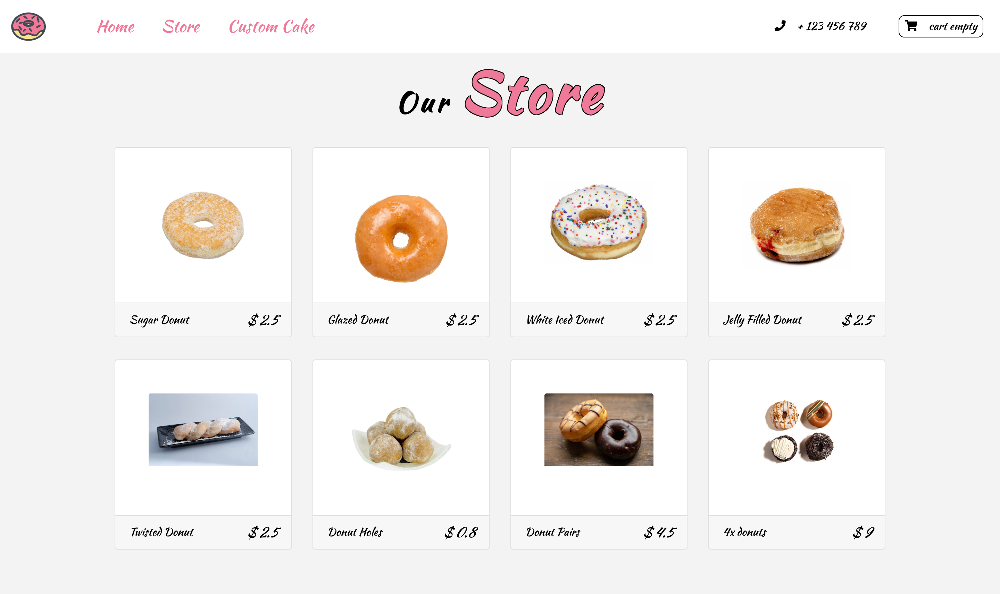
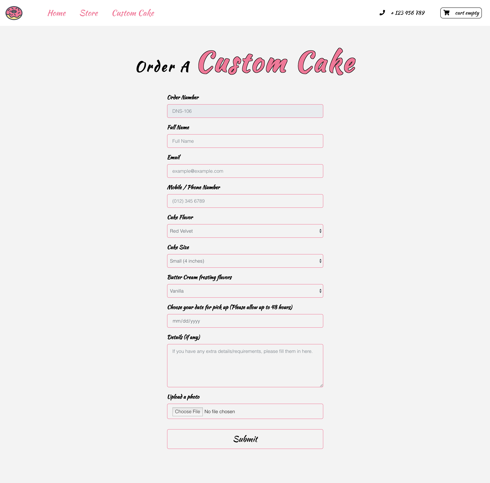
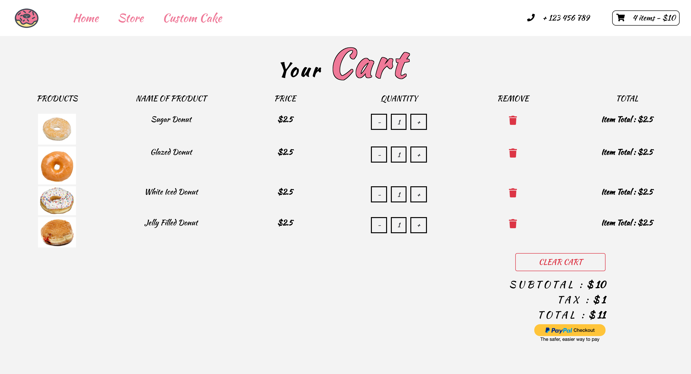

# D'Oh! Nut Sweets

D'Oh! Nut Sweets is a fully responsive mock donut and cakes online store.
You can add items to the cart which is fully working and will update the quantity, tax and totals.
The Paypal button is set up ready to use once Paypal account details have been entered.

## Screenshots
Landing Page:

Store Page:

CustomOrder Cake Page:

Cart Page:

## Built With

### Front-End
* HTML
* CSS
* React
* Bootstrap
* JavaScript
* jQuery

## Demo

- [Live Demo](https://dnsweets.now.sh/)

## GitHub Repo

- [Repo](https://github.com/W00DH0USE/D-Oh-Nut-Sweets-REACT)

## Authors

* **Iyron Woodhouse** - ** - Front-End development, styling
